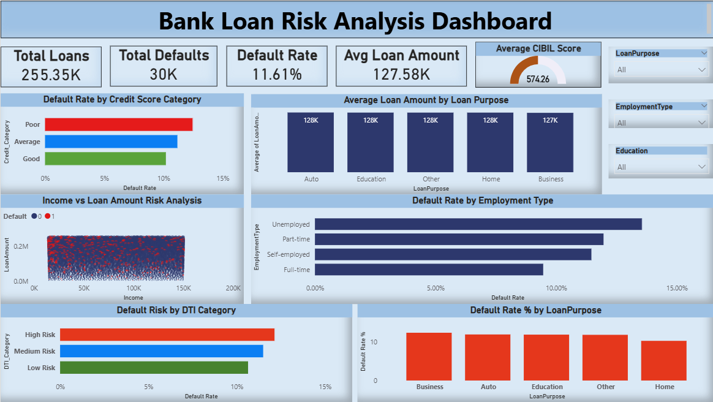

# Bank Loan Risk Analysis Dashboard

## Project Overview

This project analyzes bank loan data to identify patterns that contribute to loan defaults. The objective is to understand borrower risk and provide insights that can help financial institutions make better lending decisions.

The project combines **Python for data cleaning, SQL for data analysis, and Power BI for visualization** to create an interactive dashboard that highlights key risk factors.

---

## Tools and Technologies

* Python (Pandas, NumPy)
* SQL (MySQL)
* Power BI
* Excel

---

## Dataset Description

The dataset contains borrower financial and demographic information used to analyze loan risk.

Important features include:

* Age
* Income
* LoanAmount
* CreditScore
* MonthsEmployed
* NumCreditLines
* InterestRate
* LoanTerm
* DTIRatio
* Education
* EmploymentType
* MaritalStatus
* HasMortgage
* HasDependents
* LoanPurpose
* HasCoSigner
* Default

The **Default column** indicates whether the borrower failed to repay the loan.

* `1` → Default
* `0` → No Default

---

## Data Cleaning

Data cleaning was performed using Python before conducting analysis.

Steps included:

* Handling missing values
* Removing duplicates
* Verifying column data types
* Preparing a cleaned dataset for SQL analysis and Power BI visualization

---

## SQL Analysis

SQL was used to explore loan risk patterns and calculate important metrics.

### Key Analysis Performed

1. Default Rate Analysis
2. Default Rate by Education Level
3. Average Loan Amount by Loan Purpose
4. Identification of High-Risk Customers
5. Default Rate by Employment Type
6. Loan Amount Risk Categories
7. Credit Score vs Default Comparison
8. Interest Rate vs Default Relationship
9. Customers with Multiple Credit Lines
10. Top 10 High-Risk Borrowers
11. Default Rate by Age Group
12. Credit Score Risk Categories

Example SQL Query:

```sql id="sql101"
SELECT 
COUNT(*) AS Total_Customers,
SUM(Default) AS Total_Defaults,
(SUM(Default) * 100.0 / COUNT(*)) AS Default_Rate_Percentage
FROM cleaned_loan_data;
```

---

## Power BI Dashboard

An interactive dashboard was created to visualize loan risk indicators and borrower behavior.

### Key Performance Indicators

* Total Loans
* Total Defaults
* Default Rate
* Average Loan Amount
* Average Credit Score

### Visualizations

* Default Rate by Credit Score Category
* Default Rate by Employment Type
* Default Risk by DTI Category
* Default Rate by Loan Purpose
* Income vs Loan Amount Analysis

### Filters

The dashboard includes interactive filters for:

* Loan Purpose
* Employment Type
* Education

These filters allow users to dynamically explore different borrower segments.

---

## Key Insights

**Credit Score Impact**

Borrowers with lower credit scores tend to have significantly higher default rates compared to borrowers with higher credit scores.

**Debt-to-Income Ratio**

Higher DTI ratios are strongly associated with increased loan default risk.

**Employment Type**

Employment status plays an important role in default risk, with unstable employment showing higher risk.

**Loan Purpose**

Certain loan purposes show higher loan amounts and increased default risk.

**Age Group Risk**

Younger borrowers tend to show slightly higher default rates compared to middle-aged borrowers.

---

## Dashboard Preview


---

## Project Structure

```
Bank-Loan-Risk-Analysis
│
├── dataset
│   └── loan_data.csv
│
├── python
│   └── data_cleaning.ipynb
│
├── sql
│   └── loan_analysis_queries.sql
│
├── powerbi
│   └── loan_risk_dashboard.pbix
│
└── README.md
```

---

## Business Value

This analysis helps financial institutions:

* Identify high-risk borrowers
* Improve credit risk assessment
* Reduce loan default losses
* Support data-driven lending decisions

---

## Author

Jagan Mohan Reddy
Aspiring Data Analyst
